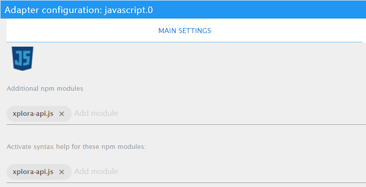
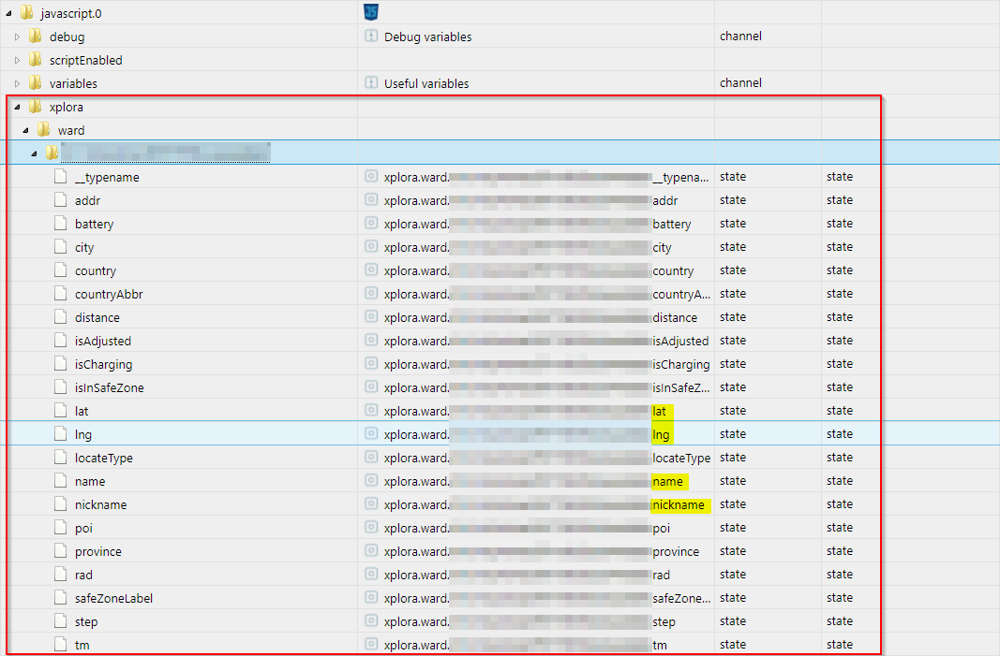

# How to use [xplora-api.js](https://github.com/MiGoller/xplora-api.js) in an [ioBroker javascript](https://github.com/ioBroker/ioBroker.javascript)

ioBroker provides a powerfull javascript engine to run your own homeautomation scripts. And you can use [xplora-api.js](https://github.com/MiGoller/xplora-api.js) easily in your own scripts to track your childrens' position, etc.

## Your Xplora login credentials

You'll have to use your Xplora login credentials for the script below you're using to login to your Xplora app on your smartphone.

Beware that Xplora allows only two so called `guardians` for a child's watch. And each guardian is allowed to login to only one device at the same time. So you'll get logged of from your smartphone app if you use the same credentials. I'm sorry for that, but these are limitations built-in to the Xplora API.

## Enable the [xplora-api.js](https://github.com/MiGoller/xplora-api.js) for your ioBroker javascript engine

First of all you'll have to install the [xplora-api.js](https://github.com/MiGoller/xplora-api.js) package to your ioBroker javascript engine instance. This process is straightforward and very easy. Just give it a try.

Please ensure you have installed the `ioBroker Script Engine` adapter and at least one instance.

### Add additional packages

Now open the instance's settings page and switch to `MAIN SETTINGS` tab. Add `xplora-api.js` to `Additional npm modules` and `Activate syntax help for these npm modules`.



Press `Save` or `Save and Close`.

The ioBroker Script Engine will start to install the required modules. After the installation succeeded within a few seconds check your ioBroker log, please. You should find some logentries like these:

``` log
5 packages are looking for funding run `npm fund` for details
+ xplora-api.js@0.1.0 added 14 packages from 14 contributors and audited 29 packages in 2.286s
npm install xplora-api.js --production (System call)
```

Well, that's it. ioBroker is now capable to use the [xplora-api.js](https://github.com/MiGoller/xplora-api.js).

## A simple script to track your childrens' position

Now that you have successfully installed the support for [xplora-api.js](https://github.com/MiGoller/xplora-api.js) it's time to write down a basic script to track your childrens' position.

Add a new javascript to your ioBroker setup with the following content.

``` javascript
/**
 * Copyright (c) 2021 MiGoller (https://github.com/MiGoller/)
 */
const xpa = require("xplora-api.js");

//  Xplora login credentials ("Guardinan")
const xploraCountryCode = "+49";            // Set to your mobile phonenumber's countrycode.
const xploraPhoneNumber = "1xxxxxxxxxx";    // Set to your mobile phonenumber without countrycode.
const xploraPassword = "xxxxxxxxxxx";       // Set to your Xplora App password.

/**
 * Pull the Xplora API for the children's position
 */
async function xploraGetWardLocations() {
    
    //  Create a Xplora API handler
    const gqlHandler = new xpa.GQLHandler(xploraCountryCode, xploraPhoneNumber, xploraPassword, "de-DE", "");

    //  Login with your Xplora credentials to the API
    const issueToken = await gqlHandler.login();

    //  Get tha last known position for each child's watch
    issueToken.user.children.forEach(async child => {
        if ((child.ward) && (child.ward.id)) {
            //  Create some basic datapoints for the children like id and name
            const xploraWardDpId = `xplora.ward.${child.ward.id}`;
            await createStateAsync(`${xploraWardDpId}.name`);
            await createStateAsync(`${xploraWardDpId}.nickname`);
            await setStateAsync(`${xploraWardDpId}.name`, child.ward.name);
            await setStateAsync(`${xploraWardDpId}.nickname`, child.ward.nickname);

            //  Get the last position of the current child's watch
            const wllResult = await gqlHandler.getWatchLastLocation(child.ward.id);

            if ((wllResult.watchLastLocate) && (wllResult.watchLastLocate.__typename == "Location")) {
                //  Location received!
                const wardLocation = wllResult.watchLastLocate;

                //  Send position data to an Places-Adapter
                sendTo('places.0', {
                    user:       child.ward.nickname, 
                    latitude:   wardLocation.lat, 
                    longitude:  wardLocation.lng, 
                    timestamp:  wardLocation.tm
                }, function (res) { log(JSON.stringify(res), "info"); });
                
                //  Publish any data just for demonstration
                for (const [key, value] of Object.entries(wardLocation)) {
                    await createStateAsync(`${xploraWardDpId}.${key}`);
                    await setStateAsync(`${xploraWardDpId}.${key}`, value);
                }
            }
        }
    });
}

/**
 * Get position data every 5 minutes
 */
schedule("*/5 * * * *", function () {
    xploraGetWardLocations();
});

//  Get position data on script startup
xploraGetWardLocations();

```

Now start the script and have a look at the javascript adapter's datapoints. You should find a lot of datapoints like these:



Enjoy.
